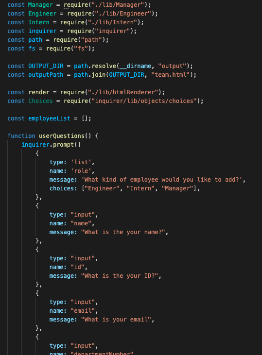
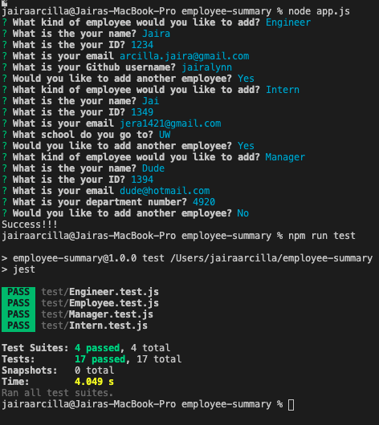

# Employee Summary

```
As a manager
I want to generate a webpage that displays my team's basic info
so that I have quick access to emails and GitHub profiles
```

## Installation

The following must be installed to run the application: Inquirer, path, fs and jest.

## Usage

This application is used through the Terminal.

## Tests

To run tests this application uses node app.js and npm run test.

Link to walk through: https://drive.google.com/file/d/15awP_djqbe8o8D1bvRu3eEfX9Rqo0adY/view


<br>


Directory structure:

```
lib/           // classes and helper code
output/        // rendered output
templates/     // HTML template(s)
test/          // jest tests
  Employee.test.js
  Engineer.test.js
  Intern.test.js
  Manager.test.js
app.js         // Runs the application
```

## Minimum Requirements

* Functional application.

* GitHub repository with a unique name and a README describing the project.

* User can use the CLI to generate an HTML page that displays information about their team.

* All tests must pass.

## Questions

My email is arcilla.jaira@gmail.com and my Github is jairalynn